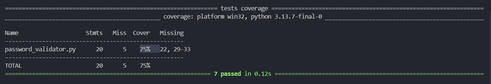

# Avaliacao-QA-P5_B

# 🔐 Validador de Senhas

Validador de Senhas é uma aplicação em Python que verifica se uma senha atende a regras de segurança predefinidas. O sistema valida o comprimento da senha, presença de letras maiúsculas e minúsculas, números, caracteres especiais e ausência de espaços em branco.  

O projeto inclui testes unitários para validar todas as regras de negócio e suporte a relatórios de cobertura de testes para garantir a qualidade do código.

